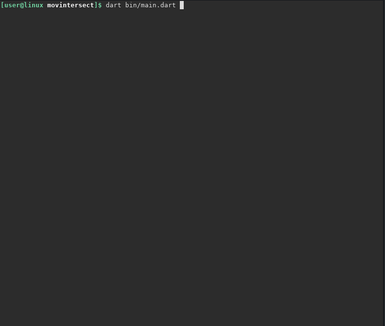

# MovIntersect
Simple command-line tool that shows what two movies have in common.

## DISCLAIMER
There may be some limitations in the amount or quality of the information obtained from the API.
It uses OMDB API. For more information visit: http://www.omdbapi.com/

## Usage
1. Get an API from http://www.omdbapi.com/apikey.aspx
2. Rename `api_keys.dart.example` to `api_keys.dart` and set the value to what you got in step 1.
3. run `dart bin/main.dart`